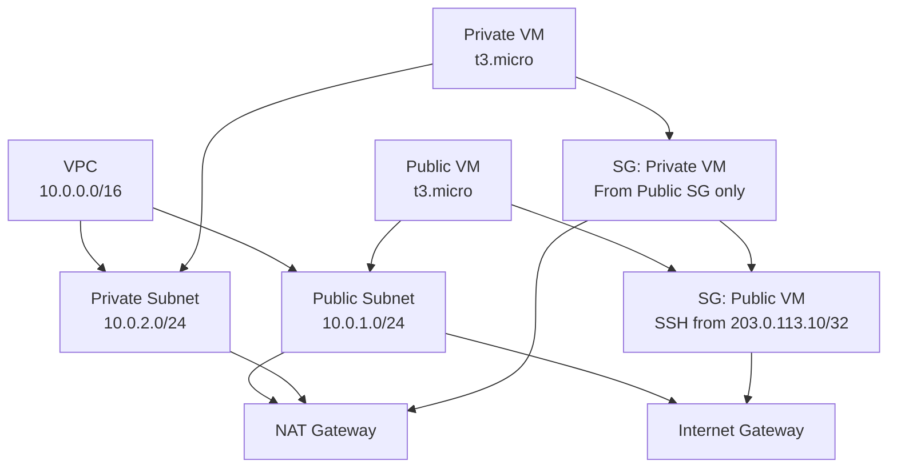

# scb-infra
Screening test for SCB

# AWS VPC + EC2 Demo (Terraform)

## Overview  
This Terraform configuration provisions a small, fully functional AWS network that demonstrates:

| Resource | Purpose |
|----------|---------|
| **VPC** (`10.0.0.0/16`) | Isolated network boundary |
| **Public subnet** (`10.0.1.0/24`) | Hosts the public EC2 instance and the NAT gateway |
| **Private subnet** (`10.0.2.0/24`) | Hosts the private EC2 instance |
| **Internet Gateway** | Gives the public subnet direct internet access |
| **NAT Gateway** (with Elastic IP) | Allows the private subnet to reach the internet |
| **Security Group – Public VM** | Allows SSH (`22/tcp`) from a single IP only |
| **Security Group – Private VM** | Allows *any* traffic **only** from the public VM’s security group |
| **EC2 – Public VM** (`t3.micro`) | Accessible from the allowed IP, can reach the internet |
| **EC2 – Private VM** (`t3.micro`) | Can reach the internet via NAT and can be accessed only by the public VM |

A Mermaid diagram is included in `docs/architecture.md` and renders on GitHub.

---

## Prerequisites  

| Tool | Minimum version |
|------|-----------------|
| Terraform | 1.5+ |
| AWS CLI (optional, for remote state) | 2.0+ |
| An AWS account with permissions to create VPC, subnets, IGW, NAT, EC2, SG, EIP, and IAM (for the default instance profile) |

Configure your AWS credentials (`AWS_ACCESS_KEY_ID`, `AWS_SECRET_ACCESS_KEY`, optionally `AWS_SESSION_TOKEN`) or set up a profile via `aws configure`.

---

## Project Structure  

```
├── main.tf          # VPC, subnets, gateways, route tables
├── security.tf      # Security groups
├── instances.tf     # EC2 resources (uses data source for Amazon Linux 2 AMI)
├── outputs.tf       # Output values (IP addresses)
├── variables.tf     # (optional) variables for IP whitelist, region, etc.
├── docs/
│   └── architecture.md   # Mermaid diagram
└── README.md        # ← this file
```

---

## How to Deploy  

```bash
# 1. Initialise the working directory
terraform init

# 2. (Optional) Review the execution plan
terraform plan

# 3. Apply the configuration
terraform apply   # type "yes" when prompted

# 4. View useful outputs
terraform output public_vm_ip
terraform output private_vm_private_ip

# 5. When finished, destroy all resources
terraform destroy   # type "yes"
```

---

## Customising the Deployment  

| Variable | Description | Default |
|----------|-------------|---------|
| `allowed_ip` | CIDR block allowed to SSH into the public VM (e.g., `203.0.113.10/32`) | `0.0.0.0/0` (replace with your IP) |
| `region` | AWS region for deployment | `us-east-1` |
| `instance_type` | EC2 instance type for both VMs | `t3.micro` |

Example `variables.tf` snippet:

```hcl
variable "allowed_ip" {
  description = "IP allowed to SSH to the public instance"
  type        = string
  default     = "0.0.0.0/0"
}
```

Reference it in the security group:

```hcl
cidr_blocks = [var.allowed_ip]
```

Run with a custom value:

```bash
terraform apply -var="allowed_ip=203.0.113.10/32"
```

---

## Diagram (Mermaid)

The architecture diagram lives in `docs/architecture.md`. It renders automatically on GitHub:



---

## Troubleshooting  

| Symptom | Likely cause | Fix |
|---------|--------------|-----|
| `Error: InvalidAMIID.NotFound` | AMI data source returned no image (region mismatch or filter typo) | Verify the region and that the filter pattern `amzn2-ami-hvm-*-x86_64-gp2` matches the current Amazon Linux 2 naming. |
| `InsufficientInstanceCapacity` | Instance type not available in the selected AZ | Change `instance_type` to a different size (e.g., `t3a.micro`) or try another AZ. |
| Unable to SSH to public VM | Wrong `allowed_ip` or security group not attached | Confirm the IP you supplied matches your client’s public IP; run `terraform output public_vm_ip` and test connectivity. |
| Private VM cannot reach the internet | NAT gateway not attached to the private route table | Ensure the private route table has a default route (`0.0.0.0/0`) pointing to the NAT gateway. |

---

## License  

This example is provided under the **MIT License** – feel free to copy, modify, and use it in your own projects.
