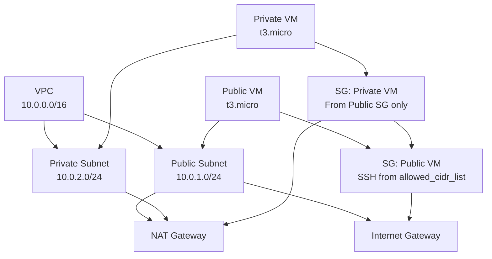

```mermaid
graph TD
    VPC["VPC<br>10.0.0.0/16"]
    PubSubnet["Public Subnet<br>10.0.1.0/24"]
    PrivSubnet["Private Subnet<br>10.0.2.0/24"]
    IGW["Internet Gateway"]
    NAT["NAT Gateway"]
    SGPublic["SG: Public VM<br>SSH from allowed_cidr_list"]
    SGPrivate["SG: Private VM<br>From Public SG only"]
    PubVM["Public VM<br>t3.micro"]
    PrivVM["Private VM<br>t3.micro"]

    VPC --> PubSubnet
    VPC --> PrivSubnet
    PubSubnet --> IGW
    PubSubnet --> NAT
    PrivSubnet --> NAT
    PubVM --> PubSubnet
    PrivVM --> PrivSubnet
    PubVM --> SGPublic
    PrivVM --> SGPrivate
    SGPrivate --> SGPublic
    SGPublic --> IGW
    SGPrivate --> NAT
```
